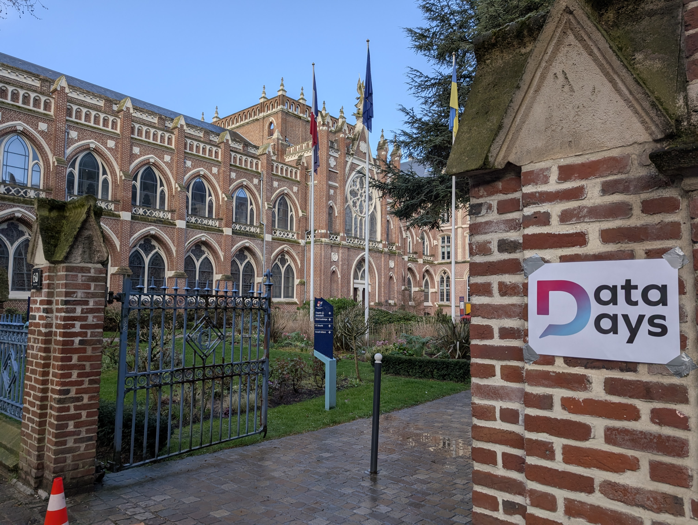
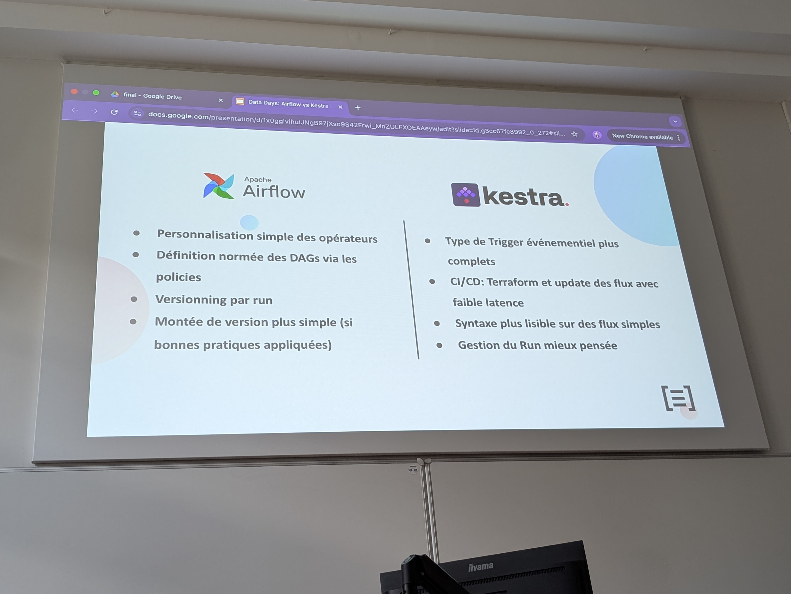

# Data Days Lille 2026

https://days.data-lille.fr/2026/fr/programme/

[English version](en/)

**Les passages en gras sont des pistes d'amélioration potentielles.**

## Intro

Il y a 10 ans, quelques étudiants de Polytech Lille lançaient un meeting big data.
C'est parti pour une nouvelle édition.
But de l'association : promouvoir l'usage de la data, créer des meetups, dizaines de participants, ...

## L'IA peut-elle tuer l'intelligence collective ? Ce que la recherche nous apprend (Olivier Nguyen Quoc)

## Datalake souverain : dbt-duckdb dans k8s un data lakehouse souverain à la main @OrangeB2B ! (Antoine Giraud et Cedric OLIVIER)

## La guerre des orchestrateurs: Airflow VS Kestra (Florian Deze et Guillaume Fauvergue)

https://days.data-lille.fr/2026/fr/presentations/la-guerre-des-orchestrateurs-airflow-vs-kestra/

Discussion au début avec les speakers, ils utilisent Kestra chez LMFR. L'idée de leur talk est de faire un retour d'expérience sur leur utilisation à la fois d'Airflow et Kestra au quotidien en tant que data engineers.

Pourquoi la présentation ? Pas mal de vécu : un flux a planté les autres flux, pourquoi mon DAG se lance plus ?
On se rend compte que ces outils sont relativement récents.
Beaucoup d'utilisateurs qui préféraient Kestra utilisaient la beta de Airflow 1.

Un orchestrateur c'est quoi ? Lancer une suite de tâches à la base. Pas juste un cron. Certains essaient de se spécialiser. Un DAG est composé de tâches. Airflow créé par Airbnb en 2016. Le talk porte sur 3.1. Kestra créé par Ludovic Dehon à LMFR, release OSS 2022, version talk 1.3.

Disclaimer : La performance n'est pas le seul critère.

Notre sujet c'est l'expérience développeur. L'idée c'est pas de comparer les plugins & intégrations mais comment créer des flux au quotidien.

## Comment construire un flux sans vouloir jeter mon PC par la fenêtre ?

Exemple : Un fichier arrive dans un stockage BLOB. Ingestion dans Data Warehouse.

## Comparaison DAG Airflow / Kestra :

Airflow long DAG en Python : flexibilité du code, important deferrable=True, dépendance explicite.

Kestra : flux avec un trigger GCS et un Load BigQuery : évènementiel natif, passage de contexte automatique, nettoyage intégré.

Réponse au débat syntaxique entre Python et YAML : pour le speaker, un data engineer reste un développeur donc doit connaître Python (opinion).
Passage du YAML avec des ":" à du "=" et ajout de {}. Pour lui c'est juste une question de syntaxe. Dire que Airflow est en Python donc refuser n'est donc pas un argument pour lui.

## Trigger et dépendance : comment déclencher mes flux ?

Dans Kestra : déclencher un flow avec cron, appel API / webhook, abonnement flux, trigger sous-flux, trigger évènementiel.

Dans Airflow : déclencher un DAG avec cron, appel API, assets (ex datasets), mix cron & assets (petite pique parce que je suis là, ils l'ont dit à la salle et que je leur ai dit avant qu'on avait les assets en version EE), **MessageQueueTrigger (nouveauté Airflow 3 : "c'est là que Kestra avait son avantage jusque là")**.

## Run : comment gérer mes flux ?

Présentation du dashboard Kestra et particulièrement de l'exécution des flux (le nerf de la guerre), présentation des filtres, puis exécution spécifiqu avec overview du flux, durée du run, 6 boutons d'action (restart, replay, pause, force run, API, delete). Diagramme de Gantt et logs également montrés.

Dans Airflow : comment trouver les anomalies dans les DAGs ? Liste des DAGs (graphique runs, filtres par status, par tag = feature appréciée...). Écran des exécutions avec filtre par état. Exécution spécifique : graphique avec lineage, clic sur tâche problématique pour voir les logs.

**Kestra est ici préféré pour le système de filtres.**

## Maintenabilité : comment monter de version sans problème ?

Dans Airflow :
"La version d'un orchestrateur n'est pas la version d'un opérateur". Opérateur Airflow ~= Plugin Kestra.
Exemple : 500 Dags utilisent l'opérateur "X". Si l'opération X a un BC je dois modifier 500 Dags !
Ne jamais utiliser les opérateurs natifs mais KubernetesPodOperator et appliquer des **Policies (= "j'ai pas trouvé dans Kestra"**, les opérateurs peuvent être bannis ou bloqués et on peut forcer les utilisateurs à utiliser certains opérateurs).

Dans Kestra :
C'est plus compliqué de faire un wrapper de plugin.
On peut utiliser des sub flows dans tâches redondantes.
Mettre des valeurs par défaut sur des arguments (pluginDefaults).
Créer son propre plugin en Java / Micronaut.
Lancer un plugin via sa propre image Docker Kestra.

## Conclusion : qui gagne ?

Chacun a des avantages et des inconvénients :

Airflow :
- Personnalisation simple des opérateurs
- Définition normée des DAGs via les policies
- Versionning par run
- Montée de version plus simple (si bonnes pratiques appliquées)

Kestra :
- Type de Trigger évènementiel plus complets
- CI/CD : Terraform et update des flux avec faible latence
- Syntaxe plus lisible sur des flux simples
- Gestion du Run mieux pensée

## Questions

Pourquoi pas Dagster ou Prefect ? Manque d'expérience pour répondre mais les challengers arrivent et proposent de répondre à ce que Airflow ne fait pas.

Il y a du multi tenancy dans Airflow et Kestra ? J'ai directement répondu que Kestra propose cela et ce que ça apporte (mais feature EE).

Une autre personne du public a parlé de [Windmill](https://www.windmill.dev/) un outil français qui a l'air intéressant.

---

Références :
https://kestra.io/vs/airflow
https://kestra.io/docs/enterprise/governance/assets
